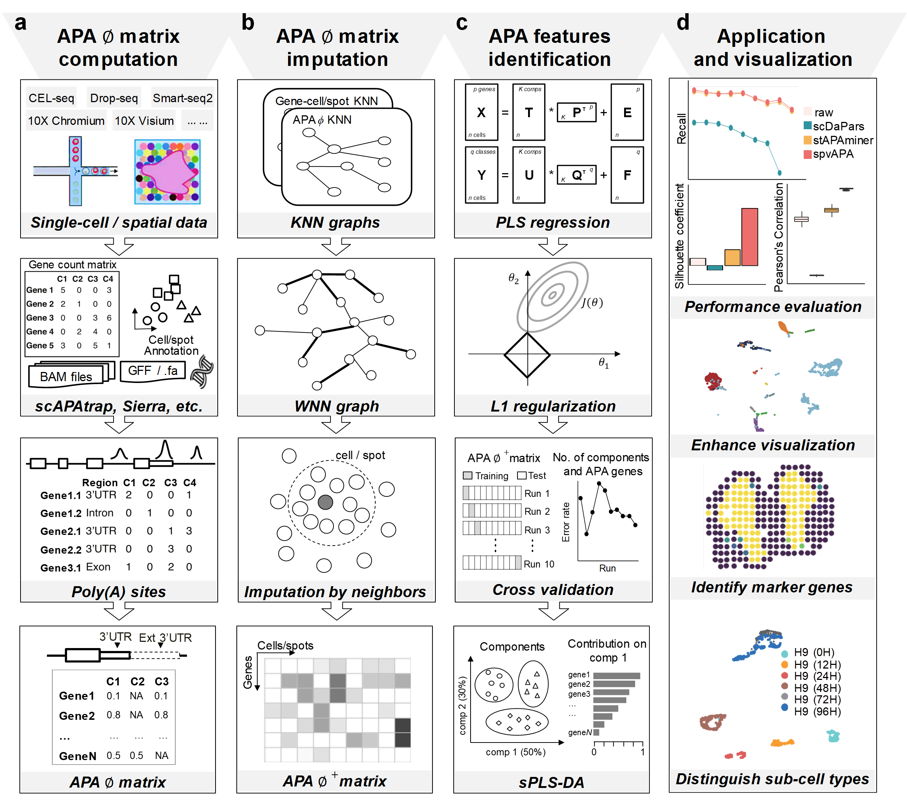

# spvAPA v0.1.0 (released on 2024/05/28)
spvAPA: multimodal imputation and supervised analysis of alternative aolyadenylation on single-cell and spatial transcriptome data  

## About  
Alternative polyadenylation (APA) is an essential post-transcriptional modification during messenger RNA (mRNA) maturation in eukaryotic cells. By calculating the relative usage rate of polyA sites, an APA matrix Φ, different from gene expression, can be obtained to interpret gene specificity from a novel perspective. With the development of single-cell and spatial transcriptome sequencing technologies, we have discovered the potential to analyze gene changes at a higher resolution. However, due to the sparsity of APA matrices and the unique nature of the data distribution, there is an urgent need to develop analytical framework suitable for APA matrices. We propose spvAPA for imputation and supervised analysis of APA matrices. spvAPA integrates information from both the gene expression matrix and the Φ matrix to impute the Φ matrix and restore APA signals. Additionally, spvAPA utilizes known prior labels to identify APA features and key APA genes related to the labels through supervised analysis, thereby improving the effectiveness of dimensionality reduction and visualization.  

* The spvAPA package mainly consists of three modules.

  

A. APA usage calculation: Use Poly(A) sites identification tool `scAPAtrap` to extract Poly(A) sites and calculate the usage rate matrix Φ.  

B. APA signal recovery: Integrate multi-modal data from the gene expression and APA usage based on WNN (Weighted Nearest Neighbors) to accurately identify the nearest neighbors for imputing missing entries in the ∅ matrix.  

C. Supervised analysis of APA: Based on sPLS-DA (sparse Partial Least Squares Discriminant Analysis), use prior labels such as histological information to perform supervised analysis of APA information in single-cell and spatial transcriptomics, identifying APA features related to the prior categories and key feature genes. Additionally, spvAPA integrates a flexible visualization component that considers both the selected features and the dual modalities of gene expression and APA, thereby enhancing the visualization of scRNA-seq or spatial transcriptomics data.  

## Getting started  
### Mandatory  
* R (>=4.2.5) (https://www.r-project.org/) is recommended.

### Required R Packages  
* aricode, cluster, clusterProfiler, ClusterR, cowplot, dplyr, ggplot2, magrittr, mclust, mixOmics, RColorBrewer, Seurat

### Installation  
* Install the R package using the following commands on the R console:

```
install.packages("devtools")
require(devtools)
install_github("BMILAB/spvAPA")
library(spvAPA)
browseVignettes('spvAPA')

##or you can download ZIP, and then unzip
devtools::install_local("your_path_of_spvAPA-master.zip", build_vignettes = TRUE)
```

## Application examples  
Vignettes can be found [here](...). Or you can also browse the vignette using the following command on the R console:
```
browseVignettes('spvAPA')
```
Data for these vignettes can be downloaded [here](https://github.com/BMILAB/spvAPA/data).  

### Impute_missing_values_based_on_WNN  
This tutorial introduces how to use the gene expression matrix and APA matrix as inputs to obtain the imputed APA matrix ∅.  

### Supervised_analysis_of_singlecell_data_using_sPLS-DA  


This tutorial inputs single-cell sequencing and cell type annotations, introduces how to use sPLS-DA to identify APA features related to cell types and enhance dimensionality reduction visualization effects through sPLS-DA feature selection..

### Supervised_analysis_of_spatial_data_using_sPLS-DA  
This tutorial uses the APA matrix from `ST` (spatial transcriptomics) sequencing, the gene expression matrix, the coordinates of spots, and histological annotations as inputs, introducing the basic workflow for supervised analysis and joint visualization of spatial transcriptomics using sPLS-DA.
